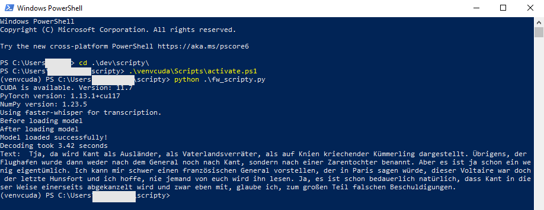

# scripty
scripty is a collection of AI powered speech to text prototypes based on [whisper](https://github.com/openai/whisper) and [faster-whisper](https://github.com/SYSTRAN/faster-whisper). For each, there is an example for processing a audio file and processing realtime microphone input. The inference is running locally. 

<p align="center"></p>


# Installation
Windows, NO CUDA
```
# install ffmpeg!
pip install -U openai-whisper
pip install torch==2.3.0 torchvision==0.18.0 torchaudio==2.3.0
pip install numpy==1.23.5
pip install faster-whisper
pip install SpeechRecognition
```

Windows, With CUDA
```
# install ffmpeg!
pip install torch==1.13.1+cu117 torchvision==0.14.1+cu117 torchaudio==0.13.1+cu117 --index-url https://download.pytorch.org/whl/cu117
pip install numpy==1.23.5 
pip install openai-whisper
pip install faster-whisper
pip install SpeechRecognition
```

